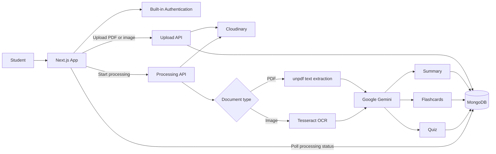

# StudyForge

StudyForge turns study materials into revision tools in one workflow. Upload a PDF or an image of your notes, then receive an exam-ready summary, flashcards for spaced repetition, and a multiple-choice quiz tailored to your selected difficulty.

## Highlights

- Upload PDFs and images of notes
- Extract text from PDFs and run OCR on images
- Generate concise, revision-ready summaries
- Receive AI-generated study tips that identify concepts to revisit and concrete revision actions
- Create flashcards with a built-in spaced-repetition review schedule
- Generate 5, 10, or 15-question multiple-choice quizzes
- Choose Easy, Medium, or Hard study-material difficulty
- Keep each user's study library private with built-in email/password authentication
- Track document-processing progress from upload through completion

## Tech Stack

| Area | Technology |
| --- | --- |
| Framework | Next.js 16, React 19, TypeScript |
| Styling | Tailwind CSS 4 |
| Authentication | Built-in email/password sessions |
| Database | MongoDB with Mongoose |
| File storage | Cloudinary |
| Study-content generation | Google Gemini 2.5 Flash |
| PDF extraction | `unpdf` |
| Image OCR | Tesseract.js |
| Response validation | Zod |

## Architecture



### Processing Flow

1. A signed-in user uploads a PDF or image from the dashboard.
2. The file is stored in Cloudinary and a document record is created in MongoDB.
3. The app starts a background processing task and updates the document status as it progresses.
4. Text is extracted from PDFs or recognized from images with OCR.
5. Gemini creates a summary, 10 flashcards, and the requested number of quiz questions.
6. Generated flashcards and quizzes are validated before they are stored.
7. The dashboard refreshes when processing completes, ready for review and practice.

## Project Structure

```text
app/
  api/                  Route handlers for uploads, processing, and study tools
  dashboard/            Authenticated study library
  sign-in/              Sign-in page
  sign-up/              Account creation page
components/             Upload, document, flashcard, and quiz interfaces
lib/                    MongoDB, Cloudinary, and Gemini clients
models/                 Mongoose document schema
lib/auth.ts              Password hashing and signed sessions
```

## Getting Started

### Prerequisites

- Node.js 20 or newer
- A MongoDB database
- A Cloudinary account
- A Google Gemini API key

### Install

```bash
git clone https://github.com/princej928/ai-study-assistant.git
cd ai-study-assistant
npm install
```

### Configure environment variables

Create a `.env.local` file in the project root:

```env
# Authentication (use a long, random value in production)
AUTH_SECRET=

# MongoDB
MONGODB_URI=

# Cloudinary
CLOUDINARY_CLOUD_NAME=
CLOUDINARY_API_KEY=
CLOUDINARY_API_SECRET=

# Google Gemini
GEMINI_API_KEY=
```

### Run locally

```bash
npm run dev
```

Open [http://localhost:3000](http://localhost:3000). Create an account, then sign in to access your study library.

## API Overview

All endpoints require authentication and verify that the requested document belongs to the current user.

| Method | Endpoint | Purpose |
| --- | --- | --- |
| `POST` | `/api/upload` | Upload a PDF or image and create its document record |
| `POST` | `/api/process/:id` | Extract text and generate a summary, flashcards, and quiz |
| `GET` | `/api/documents/:id` | Get document status and generated study content |
| `DELETE` | `/api/documents/:id` | Delete a document record from the library |
| `POST` | `/api/summarize/:id` | Regenerate a document summary |
| `POST` | `/api/flashcards/:id` | Regenerate 10 flashcards |
| `POST` | `/api/flashcards/:id/review` | Record a flashcard review rating |
| `POST` | `/api/quiz/:id` | Regenerate a 5-question quiz |

## Flashcard Review System

StudyForge uses a lightweight spaced-repetition schedule. After revealing an answer, choose `Again`, `Hard`, `Good`, or `Easy`. The app records repetitions, an ease factor, and the next review date for every card. Cards are shown only when they are due.

## Document States

| Status | Meaning |
| --- | --- |
| `uploaded` | File uploaded and ready to process |
| `extracting` | Reading text from the PDF or image |
| `summarizing` | Creating the study summary |
| `generating_assets` | Creating flashcards and quiz questions |
| `completed` | Study material is ready |
| `failed` | Processing stopped; the error is stored with the document |

## Scripts

```bash
npm run dev      # Start the development server
npm run build    # Create a production build
npm run start    # Run the production server
npm run lint     # Run ESLint
```

## Deployment

Deploy to a Node.js-compatible host such as Vercel. Add the same environment variables from `.env.local` to the deployment provider, including `AUTH_SECRET`, the MongoDB connection string, Cloudinary credentials, and Gemini API key.

The document-processing route uses the Node.js runtime because PDF extraction and OCR rely on Node-compatible packages.

## Notes

- The upload interface accepts PDF files and images up to 10 MB.
- Generated content depends on the clarity and amount of extracted text. Scanned notes with clear, high-contrast text produce the best results.
- Deleting a document removes its MongoDB record. Cloudinary asset cleanup is not currently part of the delete route.

## License

This project does not currently include a license. Add one before distributing or accepting external contributions.
